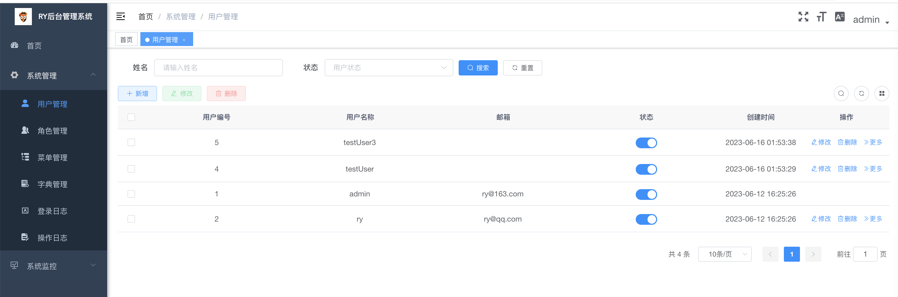
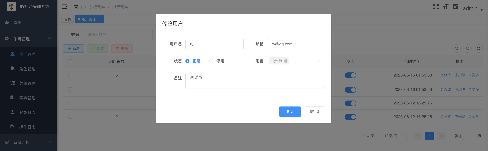
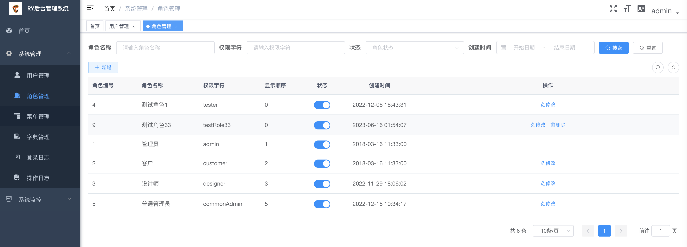
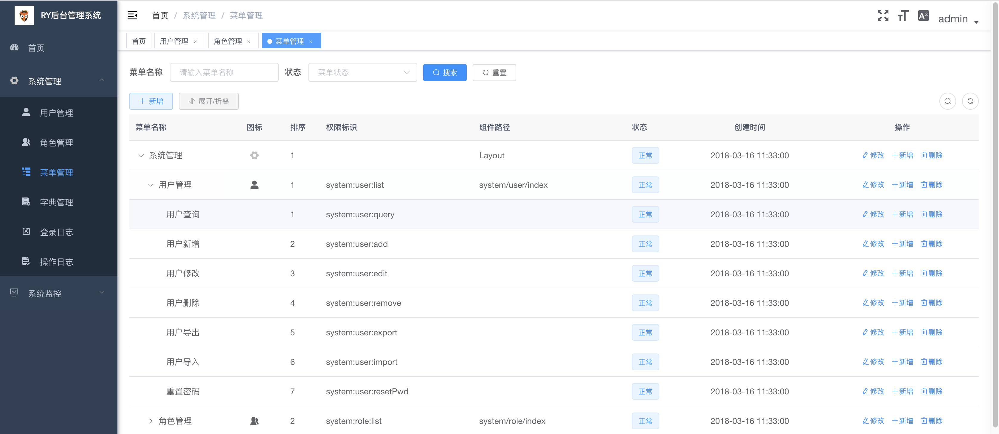
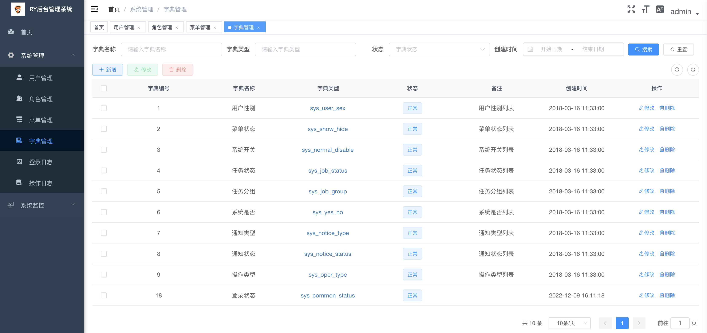
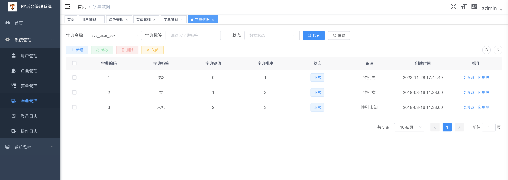
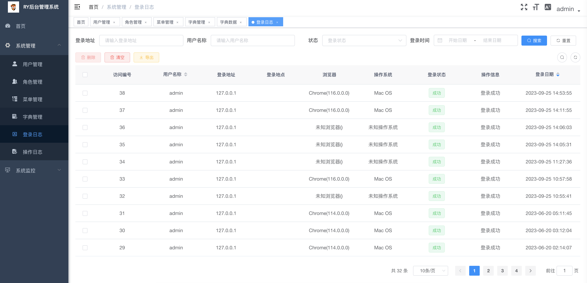
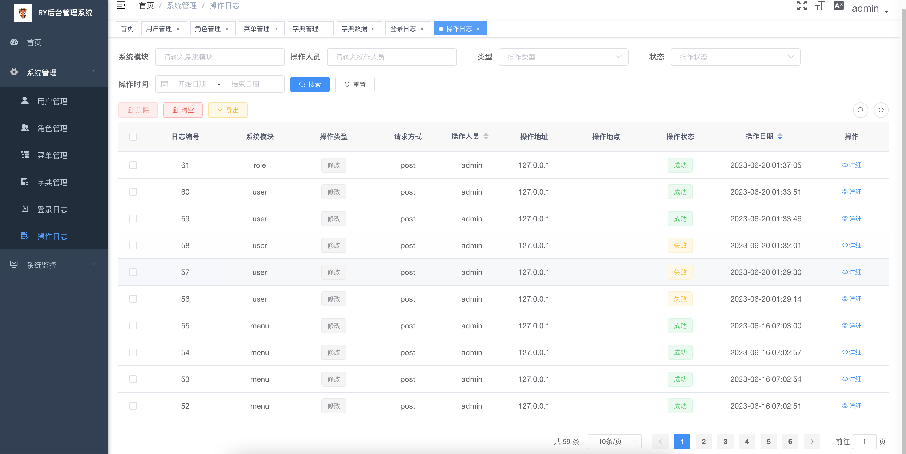
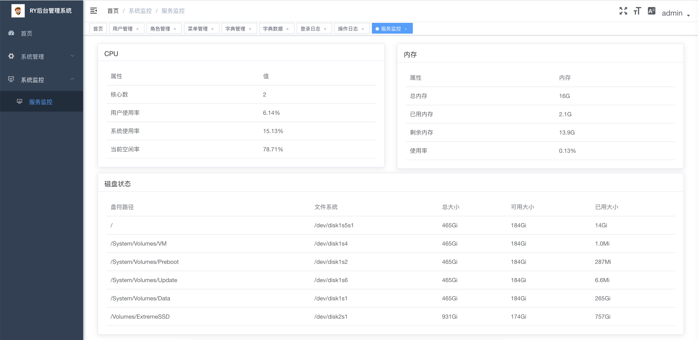
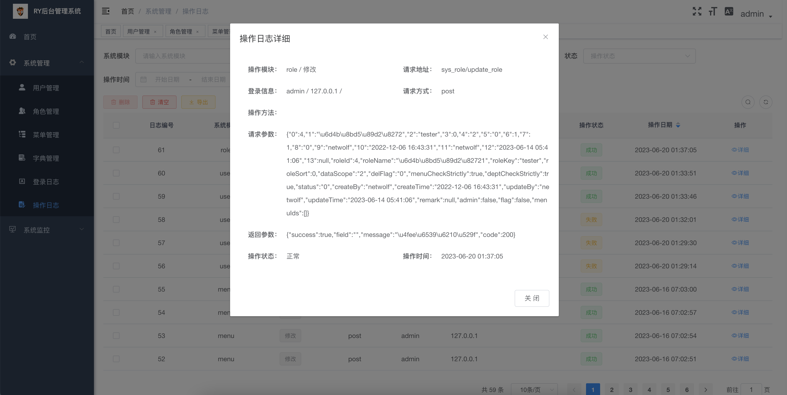

 ## 引言

一个超轻量级的PHP后台框架，由开源框架 [MINI](https://github.com/panique/mini) 和 [CodeIgniter](https://github.com/bcit-ci/CodeIgniter) 结合而成。基本框架为MINI，但是数据库引擎用的是CodeIgniter。

怎么说呢，看重的是MINI的超轻量级，但感觉数据库部分又太过于简单了，所以又从CodeIgniter挖了部分过来，希望这是个正确的选择吧。

做这个项目的起因是因为一直在用一个很著名的前后端分离项目 [若依](https://github.com/yangzongzhuan/RuoYi-Vue) 做一些小项目，因为基本的用户管理功能都有了，只要做业务就行，很是便利。

但是随着项目增多就发现java太耗资源了，一个简单的小项目，没什么访问量，但是内存、CPU都会被吃掉一大堆，随着部署的项目增多，服务器就会不堪重负。像我们这种做小项目的，本身就没几块钱，如果一个项目搞一个服务器，那后面服务器的维护成本就会不堪重负。所以想着能否搞个超轻量级的后台服务，前端还是用的ruoyi-vue的前端，基本数据库表也不用去动他，还是熟悉的配方，只是把后端语言变一下。于是就想到了php，由于本人主要是做C开发的，java算是第二语言，php就更差了，所以只能当个裁缝，四处拿过来缝缝补补，最终目的就是能用就行。
   
也因为白嫖了若依那么久，所以把这个开源出来，希望对大家有点帮助吧。


## 需求

- PHP 5.3.0+、PHP7.4简单自测可用.
- Redis 用于缓存用户session
- MySQL
- SQlite
  支持SQLite是想着在嵌入式设备也能用起来，这样就不用装MySQL这些，进一步减少开销。实测在RK3308、S905x这些芯片上可用。
  但这其实是个伪命题，主要是内存和flash空间占用的问题，都用上PHP、前后端分离（实测发现编译出来的前端空间也不小）了，这些flash空间占用都不小，再去省MySQL的空间是否还有必要？

## 目录说明

- docs：存放一些文本文件
    ry-php.postman_collection.json：后端接口说明，导入postman即可使用
- ry-server：用php编写的后端代码
- ry-ui：从[ruiyi-vue](https://github.com/yangzongzhuan/RuoYi-Vue) 改造而来的前端代码，准备弃用，已完全支持ruoyi-vue最新版本（v3.8.6）的前端页面。建议大家直接下载ruoyi-vue的代码，直接拿ruoyi-ui目录的代码进行配套使用。
- sql：数据库脚本
    ry_php.db: SQLite数据库，在ry-server/application/config/database.php中配置正确的路径即可直接使用。
    ry_php.sqlite：生成SQLite数据库的脚本，可通过SQLite工具导入生成所需的数据库
    ry_php.sql：生成MySQL数据库的脚步，可通过MySQL工具导入生成所需的数据库
- images：示例图片

## web服务器部署举例

### nginx服务器的部署配置

```nginx
server {
        listen  80;
        listen  [::]:80;
        server_name  localhost;
        access_log off;
	
        client_max_body_size 40m;

        #charset koi8-r;

        #access_log  logs/host.access.log  main;

        location / {
            root   前端页面根目录/dist;
            index  index.html index.htm;
        }

        #跳转到php服务器
        location /prod-api/ {
            proxy_set_header Host $http_host;
            proxy_set_header X-Real-IP $remote_addr;
            proxy_set_header REMOTE-HOST $remote_addr;
            proxy_set_header X-Forwarded-For $proxy_add_x_forwarded_for;
            proxy_pass http://localhost:8088/;
        }

        #error_page  404              /404.html;

        # redirect server error pages to the static page /50x.html
        #
        error_page   500 502 503 504  /50x.html;
        location = /50x.html {
            root   html;
        }
    }
#配置后端服务
server {
        listen  8088;
        server_name  phpServer;
        access_log off;
	    client_max_body_size 40m;


        location / {
            root   php源码根目录/public;
            #index  index.html index.htm index.php;
	        if (!-e $request_filename) 
            {                                 
               rewrite ^(/index.php|/index.php/|/)(.*)$ /index.php?$1 last;
               break;
            }
        }


        error_page   500 502 503 504  /50x.html;
        location = /50x.html {
            root   html;
        }

        #设置php代理，检测是.php结尾的文件时自动调用fastcgi，使之调用php解析程序，解析处理后返回结果
        location ~ \.php$ {
            root           php源码根目录/public;
            fastcgi_pass   127.0.0.1:9000;
            fastcgi_index  index.php;
            fastcgi_param  SCRIPT_FILENAME  $document_root$fastcgi_script_name;
            include        fastcgi_params;
            add_header X-Frame-Options SAMEORIGIN;
            #deny all;
            #allow all;
        }
      
}

```

更详细的Nginx配置教程，可以看它的官方网站 [点击此处](https://github.com/panique/mini/issues/55).

## 快速开始

### 前端介绍

 前端从 [ruiyi-vue](https://github.com/yangzongzhuan/RuoYi-Vue) 改造而来，只是后端接口路径做了部分修改，所以还是直接看若依的官方说明吧，已经写得很详细了，[点击此处](http://doc.ruoyi.vip/ruoyi-vue/)。

### 后端介绍

* 后端介绍中所有涉及到文件路径的都是基于ry-server目录下的相对目录

#### 基本架构

应用程序的 URL 路径会直接转换为控制器及其内部方法
比如

URL路径：`example.com/home/exampleOne` 会执行application/controllers/home.php这个php文件里申明的exampleOne()函数。

URL路径：`example.com/home` 会执行application/controllers/home.php这个文件里申明的index()函数。

URL路径：`example.com` 会执行application/controllers/home.php这个函数里申明的index()函数 (缺省调用)。

URL路径：`example.com/songs` 会执行application/controllers/songs.php这个文件里申明的index()函数。

URL路径：`example.com/songs/editsong/17` 会执行application/controllers/songs.php这个文件里的editsong函数，并将17作为参数传递给它。


#### 持久化数据库配置

数据库配置文件applicaition/config/database.php，通过改变dbdriver配置选择使用哪种数据库，当前时测支持MySQL和SQLite，数据引擎的封装代码为application/core。

 MySQL配置举例
```php
    $db['default']['hostname'] = '数据库URL';
    $db['default']['username'] = '数据库登录账号';
    $db['default']['password'] = '数据库密码';
    $db['default']['database'] = '数据库名';
    $db['default']['dbdriver'] = 'mysqli';  //MySQL的数据引擎
    $db['default']['dbprefix'] = '';
    $db['default']['pconnect'] = FALSE;
    $db['default']['db_debug'] = TRUE;
    $db['default']['cache_on'] = FALSE;
    $db['default']['cachedir'] = APPPATH.'cache/html';;
    $db['default']['char_set'] = 'utf8';
    $db['default']['dbcollat'] = 'utf8_general_ci';
    $db['default']['swap_pre'] = '';
    $db['default']['autoinit'] = TRUE;
    $db['default']['stricton'] = FALSE;
```

SQLite配置举例
```php
    $db['default']['dbdriver'] = 'sqlite3'; //SQLite的数据引擎
    $db['default']['database'] = 'sqlite数据库存放位置';
```

#### 缓存数据库配置

缓存数据库配置文件applicaition/config/redis.php，redis的封装代码路径为application/core/redis.php。

redis配置举例
```php
    //默认缓存数据库
    $redis_config['redis_default']['host'] = '缓存数据库地址'; 
    $redis_config['redis_default']['port'] = '缓存数据库端口，默认为6379'; 
    $redis_config['redis_default']['password'] = '缓存数据库访问密码，可以为空'; 
    
    //从数据库，当实现redis分布式部署时才有用，尚未实测
    $redis_config['redis_slave']['host'] = '';  
    $redis_config['redis_slave']['port'] = '6379';  
    $redis_config['redis_slave']['password'] = ''; 
```
#### 编写数据处理模型

在applicatoin/model增加数据处理的模型，比如sys_user.model，继承自application/core/model.php，基本的增删改查操作都已被model.php封装，
sys_user.model只需封装跟业务相关的查询函数即可，比如

```php
    public function validateUnique($username) {
		$adminInfo = $this->get('*', array("lower(user_name)"=>strtolower($username)));
		if ($adminInfo) {
		    return true;
		}

		return false;
	}
```

#### 编写控制器代码

在applicatoin/controller/目录下增加控制器代码sys_user.php，在构造函数中将需要用到的模块引用进来，比如
```php
    public function __construct($model_name) {
		parent::__construct($model_name);
        //引入sys_user数据模块
        $this->User_model = Helper::load_model("Sys_user",$this->db);
        ...
    }
```

在控制器中增加接口代码，比如
```php
    /**
     * 获取登录用户的信息
     */ 
	public function getInfo(){
        //会话判断
		$user_id = $this->login_user_id;
		if (!$user_id) {
			printAjaxError('username', '会话已失效，请重新登录');
		}
        //获取用户信息
		$userInfo = $this->User_model->get("user_id as userId,user_name as userName,avatar",array('user_id'=>$user_id));
		if(!$userInfo ){
			printAjaxError('user_id', '用户不存在');
		}
		$userInfo['token'] = getEnUserId($this->redis);

		$userInfo['admin']=_is_admin($user_id);
		$permsList = array();

		$tmpPermsLIst = $this->_get_menu_permission($user_id);
		if($tmpPermsLIst){
			foreach($tmpPermsLIst as $key=>$value){
				if(isset($value['perms'])){
					array_push($permsList,$value['perms']);
				}else{
					array_push($permsList,$value);
				}
			}
		}
        //回复获取成功，将接口数据以application/json的形式返回给前端
		printAjaxRaw(array('code'=>200,'permissions'=>$permsList,'roles'=>$this->_get_role_permission($user_id),'msg'=>"操作成功",'user'=>$userInfo));
	} 
```

#### 访问白名单配置

在application/core/application.php中集成了简单的访问过滤器fiter函数，当访问的url不在访问白名单内时，执行登录认证，若认证不通过，则返回403，默认除登录函数外，其他所有请求都需登录认证，若不需要认证，则在application/config/whitelist.php中将URL加入白名单列表即可。
```php
// 白名单列表格式
// $whiteList[controller][method] = 1; //=非0，表示对应控制器的某个方法无须登录校验
// 比如
$whiteList['sys_user']['login'] = 1;
```


#### 若依接口兼容

在application/config/ruoyimapper.php中增加了php版本的接口与若依前端接口的映射表，通过映射表可实现若依前端页面的零修改兼容，目的是方便大家实现后端服务器的平移替换，当php版本的不再满足需求时，可直接换回若依后端。

实现原理很简单，就是在application/core/application.php中实现了url请求转换函数convertRuoyiUrl，在真正解析url前，先把若依前端的url格式转换成php服务端相应请求的url格式。

映射表的配置规则举例
```php
// ruoyiApiMapper为映射表
// 第一个键值为请求类型，如post、get、put、delete，要求为小写
// 后面的键值给请求url，比如前端页面的请求为 /system/user/list
// url中作为参数的部分不用作为键值
// 比如/system/user/1，其中的1对应/system/user/{userId}，是作为userId这个参数，所以只需取/system/user即可
// 则第二个键值为system，第三个键值为user，第四个键值给list
// 映射的值为在php服务端的请求路径
// 比如前端页面的请求路径为/system/user/list，请求类型为get
// 对应的php服务端路径为sys_user/get_sys_user_list
// 则映射表表达式为
$ruoyiApiMapper['get']['system']['user']['list'] = "sys_user/get_sys_user_list";

// 不能存在路径完全一样的映射键值，假如出现前面几个键值完全一致时，则可以在后面再补增一个为index的键值
// 比如前端页面的请求路径为/system/user/1，请求类型为get
// 原先写成映射表达式为
$ruoyiApiMapper['get']['system']['user'] = "sys_user/get_sys_user_info";

// 但因['get']['system']['user']这部分键值与$ruoyiApiMapper['get']['system']['user']['list'] = "sys_user/get_sys_user_list";前面部分完全一致
// 所以需要改造成如下映射关系
$ruoyiApiMapper['get']['system']['user']['index'] = "sys_user/get_sys_user_info";
```

## 演示图
<table>
    <tr>
        <td></td>
        <td></td>
    </tr>
    <tr>
        <td></td>
        <td></td>
    </tr>    
    <tr>
        <td></td>
        <td></td>
    </tr>       
    <tr>
        <td></td>
        <td></td>
    </tr>       
    <tr>
        <td></td>
        <td></td>
    </tr>       
</table>


## 鸣谢

- MINI: https://github.com/panique/mini
- CodeIgniter: https://github.com/bcit-ci/CodeIgniter
- ruoyi-vue: https://github.com/yangzongzhuan/RuoYi-Vue

## 安全

该脚本利用mod_rewrite并阻止对 /public 文件夹之外的所有内容的访问。
您的.git文件夹/文件，操作系统临时文件，应用程序文件夹和其他所有内容都无法访问

## 证书

此项目的证书是基于 MIT.
您可以免费使用、修改或用于商用项目。